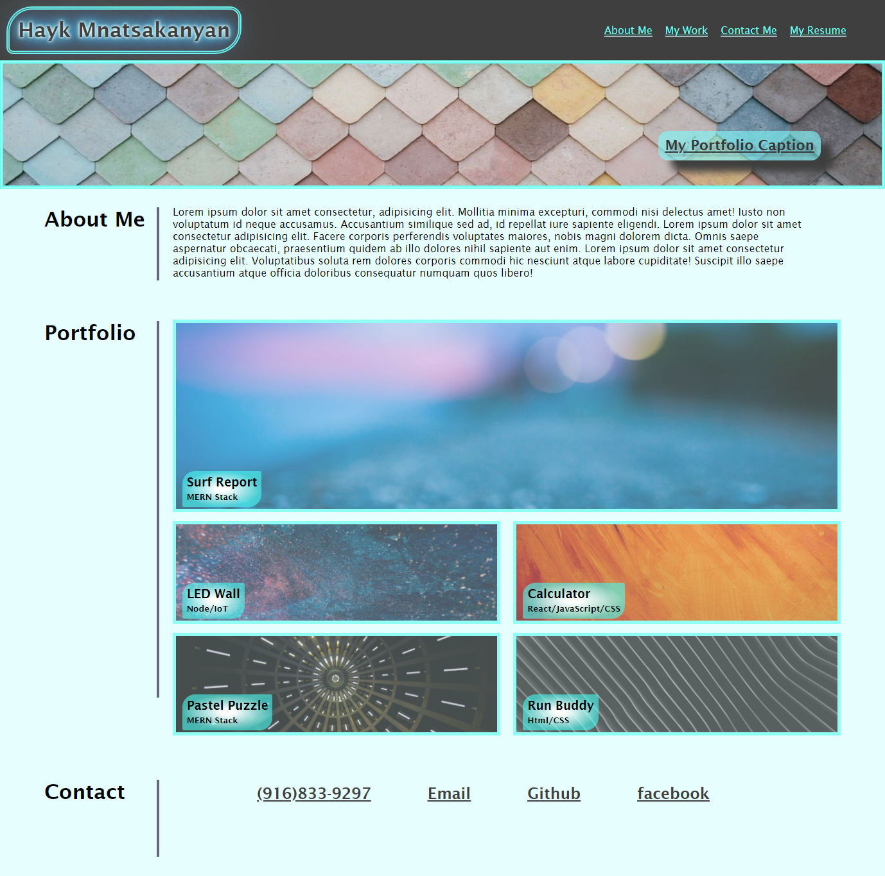

# My Portfolio Website

---

---

## Requirements necessary to develop a portfolio that satisfies a typical hiring manager’s needs:

```
GIVEN I need to sample a potential employee's previous work
WHEN I load their portfolio
THEN I am presented with the developer's name, a recent photo, and links to sections about them, their work, and how to contact them
WHEN I click one of the links in the navigation
THEN the UI scrolls to the corresponding section
WHEN I click on the link to the section about their work
THEN the UI scrolls to a section with titled images of the developer's applications
WHEN I am presented with the developer's first application
THEN that application's image should be larger in size than the others
WHEN I click on the images of the applications
THEN I am taken to that deployed application
WHEN I resize the page or view the site on various screens and devices
THEN I am presented with a responsive layout that adapts to my viewport
```

#### html

     [x] Created html document and style.css and linked them together
     [x] Added Title to my portfolio website
     [x] Added body, header, main, and footer sections
     [x] Added h1 tag for my name and list items for portfolio navigation
     [x] Added href attributes for a tags so we can jump to desired section
     [x] Added div for hero image and added my portfolio cool caption
     [x] Added mainContainer class for each section
     [x] Added paragraph for About me section with lorem text
     [x] Added portfolio section and linked images
     [x] Added h3 h5 for on image captions
     [x] Added alt text for each image
     [x] Added contact me section with list items and working links

### CSS

    [x] Added variables vor colors so they can be used later
    [x] Added color and font family for whole page
    [x] Added flexbox for header so I can align nav links and my name and add media query later
    [x] Also added flex for nav bar list items so I can space them correctly
    [x] Added double border for my name and came up with cool glowing effect for text shadow
    [x] Added hero image styling
    [x] Added Cool caption styling and came up with animation that will bump on top of the heto image
    [x] Styled about me section
    [x] Added flexbox for pictures section. flex: 0 0 100% for big image and flex: 0 0 49% for the rest so we meet requirements of project
    [x] Styled text on images added radial gradient and transparency for background
    [x] Added footer ul items and styled them
    [x] With on hover selector added transition for portfolio image border radius changed cursor to grab cursor and bringing back (focusing) opacity on selected image
    [x] Also added transition for image captions changing position shadow border color and font
    [x] With after selector added line next to each section header
    [x] Added media query, changing header nav and footer contacts to column, hideing image texts once resized
    [x] Added keyframes for cool caption bump effect

---


